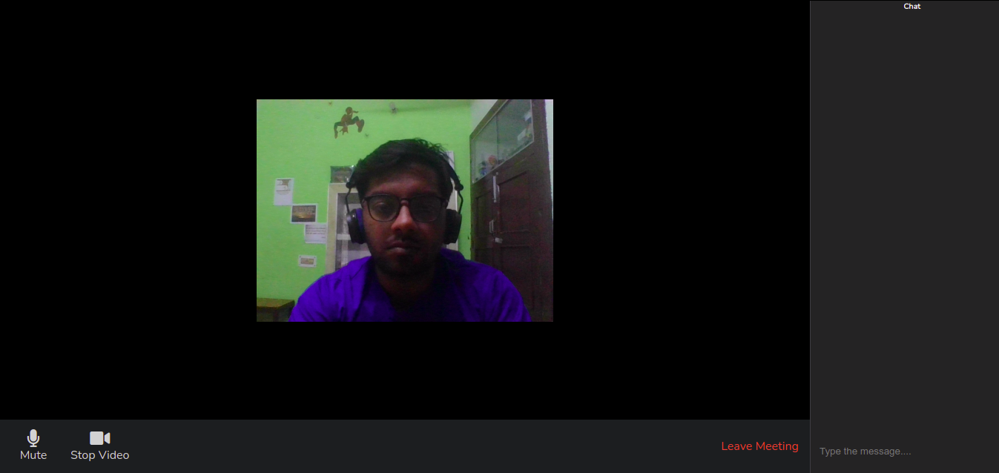

 

# Let's Meet
Let's Meet is a video confrencing App made using NodeJs. It uses socket.io and peerjs for custom rooms and peer to peer networking. User can easily signup and then start a video call with their colleagues. 

 

https://lets-meet-sg.herokuapp.com/

### TODO
- [ ] Add leave Meeting feature.
- [ ] Add user name with the messages. 
- [ ] Screen share.